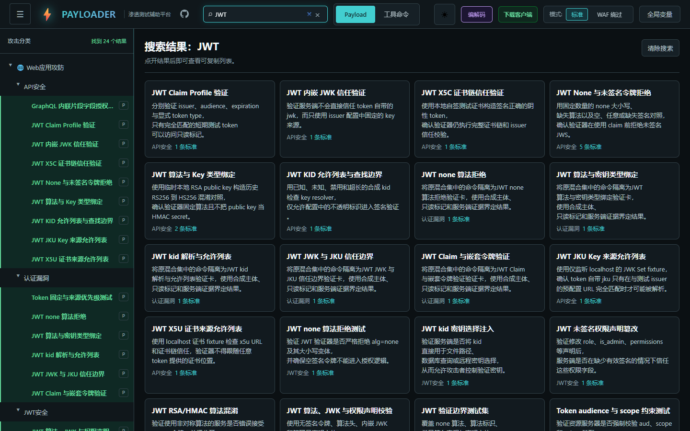
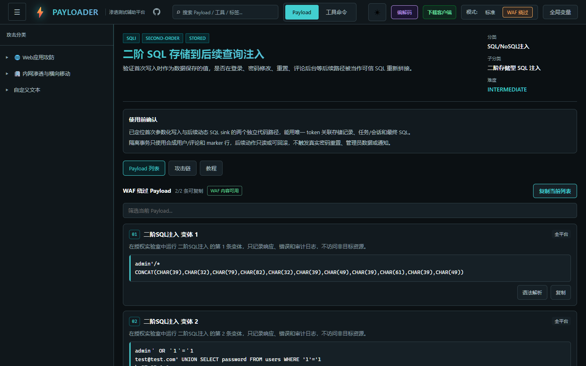
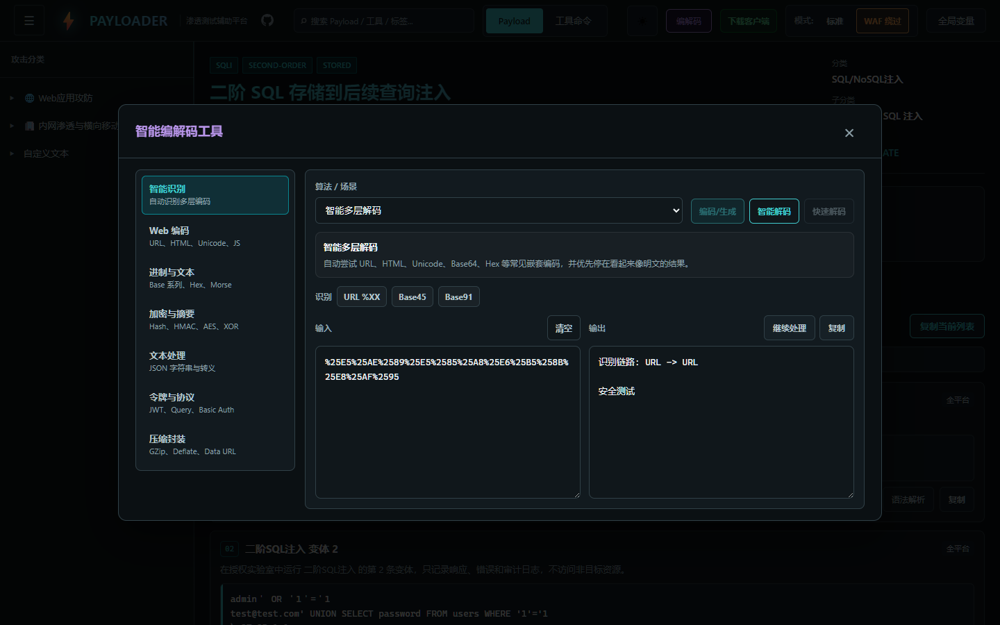
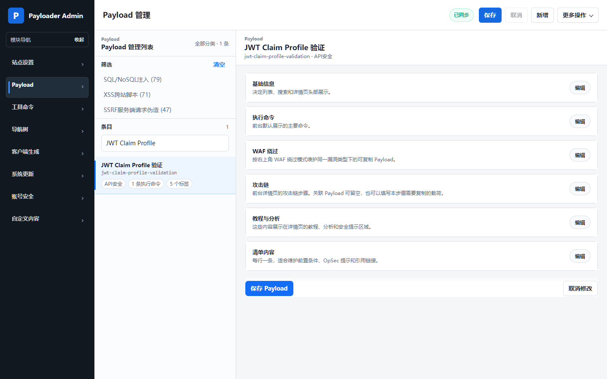
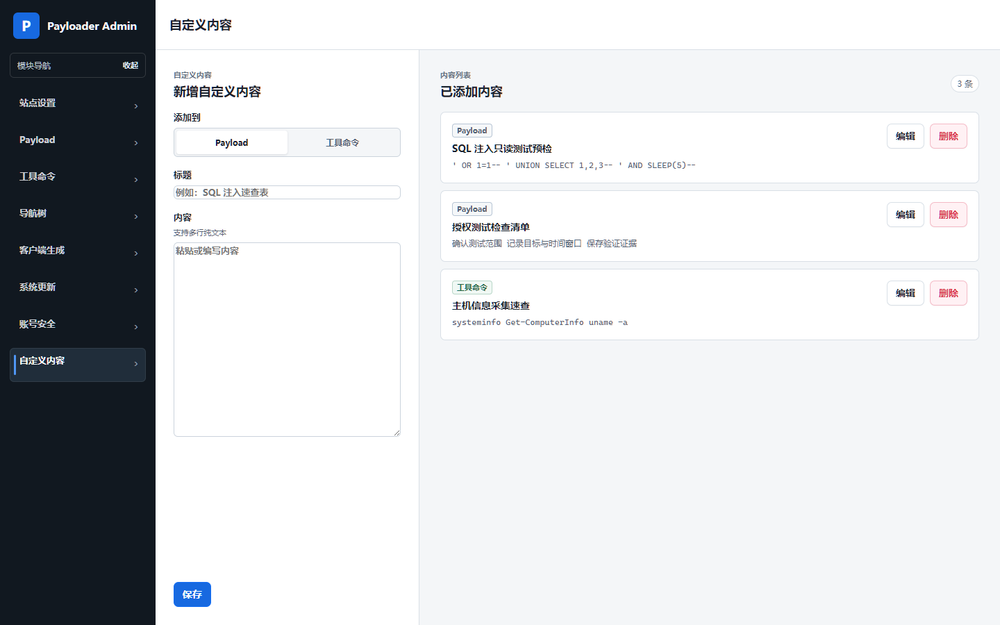
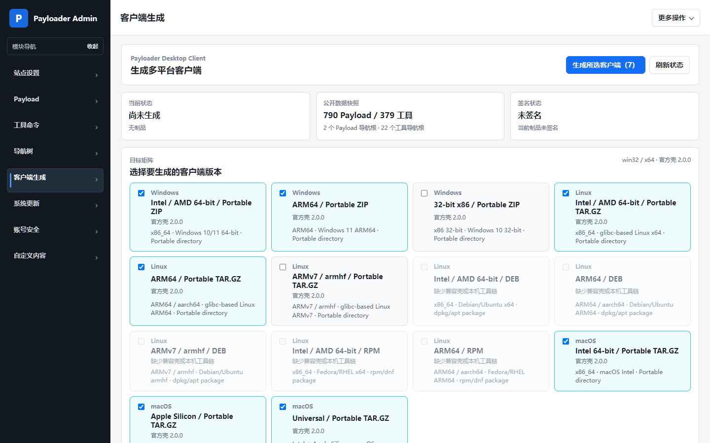
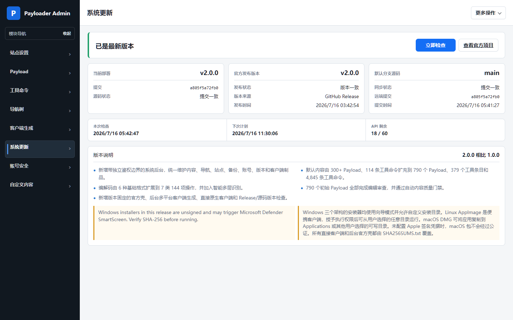
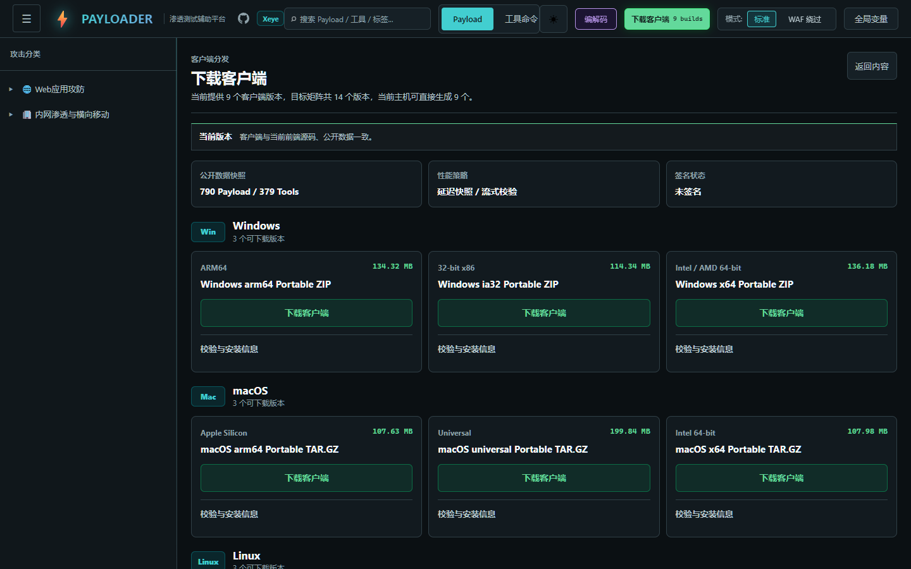
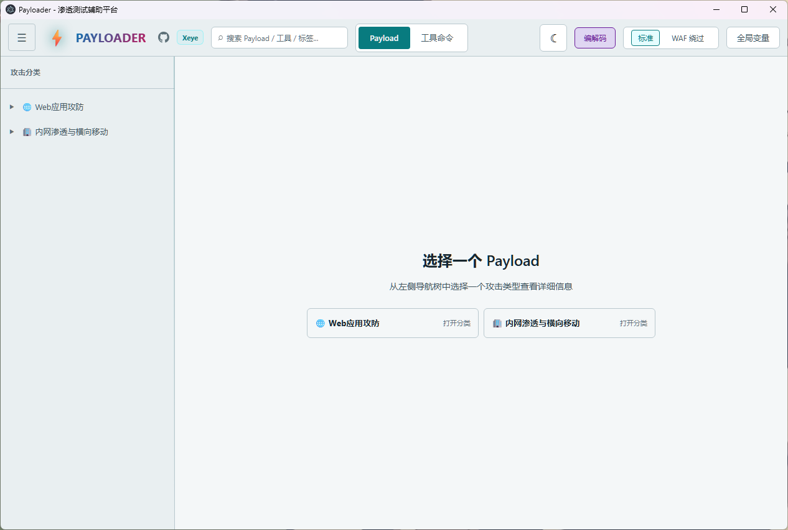
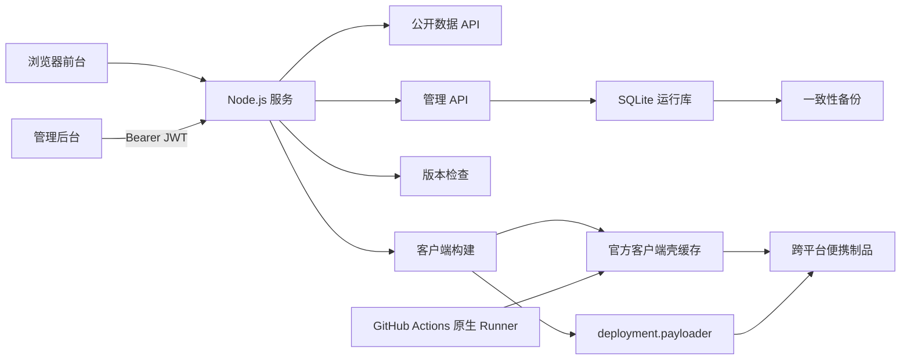

<div align="center">

# Payloader

面向授权安全测试、攻防演练与安全研究的自托管知识工作台。

统一管理 Payload、工具命令、变量、编解码流程和离线桌面客户端。

[](https://github.com/3516634930/Payloader/releases)
[](https://github.com/3516634930/Payloader/actions/workflows/quality.yml)


[](LICENSE)

[下载 v2.0.0](https://github.com/3516634930/Payloader/releases/tag/v2.0.0) · [更新日志](#更新日志) · [快速部署](#快速开始) · [客户端生成](#客户端与后台生成)

</div>

## 项目概览

Payloader 将安全测试资料、操作模板和日常编码工具整理为一套可检索、可维护、可离线分发的系统：

- 前台用于检索 Payload 和工具命令，替换变量，查看语法、攻击链、教程与参考资料。
- 后台用于维护内容、导航、站点配置、自定义文本、备份恢复、版本状态和客户端制品。
- Node.js 服务负责 SQLite 数据、Bearer JWT 鉴权、公共数据快照、系统更新检查和客户端构建。
- Electron 客户端只携带公开内容，可在 Windows、Linux 和 macOS 离线使用。
- GitHub Actions 在三个原生系统 Runner 上构建并校验正式客户端。

系统默认面向单实例、自托管部署，不要求 MySQL、Redis 或外部对象存储。

## 界面预览

| 安全知识工作台 | Payload 详情 |
| --- | --- |
|  |  |

| 编解码工作台 | 后台内容管理 |
| --- | --- |
|  |  |

| 自定义内容 |
| --- |
|  |

| 客户端生成 | 系统更新 |
| --- | --- |
|  |  |

| 客户端下载 |
| --- |
|  |

| 桌面客户端 |
| --- |
|  |

## 内容规模

当前默认安装首次运行包含：

| 内容 | 数量 |
| --- | ---: |
| Payload | 790 |
| 工具条目 | 379 |
| Payload 执行项 | 1,275 |
| WAF 变体 | 205 |
| 攻击链步骤 | 3,003 |
| 工具命令 | 4,845 |
| 带教程的 Payload | 790 |
| 编解码操作 | 144 |
| 全局变量 | 198 |

部署者可以在后台继续增删、导入、导出和重排内容。`server/default-seed.sqlite` 只用于首次初始化与恢复默认数据，运行中的权威数据位于 `data/payloader.sqlite`，一致性备份保存在 `data/backups/`。

## 功能

### Payload 与工具工作台

- Payload、工具命令双工作区和独立树形导航。
- 对名称、描述、分类、标签和命令内容建立共享搜索索引。
- Payload 页面支持命令内搜索、普通/WAF 模式、单条复制和当前结果批量复制。
- 全局变量集中编辑，展示与复制时统一替换并高亮命中位置。
- 展示平台、权限、难度、前置条件、语法解析、攻击链、教程、防御说明和参考资料。
- 工具页面提供安装命令、平台标签、示例、语法和引用来源。
- 深色/浅色主题、键盘导航和移动端响应式布局。

### 编解码工作台

7 类 144 项操作覆盖：

- 智能多层编码识别。
- URL、HTML、Unicode、字符串转义与 Base 系列。
- Hash、HMAC、现代对称密码、国密算法和经典密码。
- JWT、OTP、Basic Auth、PEM、ASN.1、JWK/JWE。
- CBOR、MessagePack、Protobuf Wire 和 BSON。
- GZip、Deflate、Data URL 和常见二进制表示。

编解码计算在本地前端完成，不会把输入提交到第三方服务。

### 管理后台

| 模块 | 主要能力 |
| --- | --- |
| 站点设置 | 标题、副标题、浏览器标题和 Logo |
| Payload | 新增、编辑、删除、筛选、分页和内容校验 |
| 工具命令 | 安装命令、示例、语法、参考资料和平台信息 |
| 导航树 | 分别维护 Payload 与工具分类、顺序和绑定关系 |
| 客户端生成 | 选择系统、架构和格式，查看任务、日志、SHA-256 与制品 |
| 系统更新 | 检查稳定版本、默认分支提交和 API 限额 |
| 账号安全 | 修改管理员账号和密码，撤销旧会话 |
| 自定义内容 | 将文本放入 Payload 或工具命令栏目，并可跨目标移动 |

内容维护支持 JSON 模板、20 MiB 导入预览、合并或覆盖导入、完整导出、重置影响预览，以及创建一致性备份后恢复默认数据。自定义内容以纯文本展示，可归入 Payload 或工具命令栏目。

### 系统更新

更新中心只读检查固定官方仓库，不会自动下载、覆盖或执行远端代码：

- 稳定版本依次检查最新 Release、稳定语义化标签和远端 `package.json`。
- 源码通道比较当前部署提交与默认分支，区分同步、远端领先、本地领先和分叉。
- 使用 ETag 条件请求，默认每 6 小时检查一次，并支持后台手动检查。
- GitHub 暂时不可用或达到限额时保留上一次成功结果。

## 更新日志

### v2.0.0 【2026.07.16】

2.0.0 在 1.0.0 首发版本基础上完成了从静态知识库到可维护、自托管平台的升级。[下载 v2.0.0](https://github.com/3516634930/Payloader/releases/tag/v2.0.0) · [查看 1.0.0 首次发布介绍](https://mp.weixin.qq.com/s/iRGZFihwerukDJcJF_2DBw)

- **新增管理后台**：提供内容、导航、站点、自定义文本、备份、账号、版本和客户端等 8 个管理模块，并建立独立鉴权边界。
- **扩充内容规模**：由 300+ Payload、114 条工具命令扩充至 790 个 Payload、379 个工具条目和 4,845 条工具命令。
- **提升初始内容质量**：完成 790/790 条内容编辑审查，分类、教程、引用和命令纳入自动质量门禁。
- **增强编解码工具**：由 6 项基础操作扩展至 7 类 144 项操作，新增智能多层识别与连续转换。
- **新增客户端生成**：后台支持 14 项目标矩阵、9 个官方客户端壳和当前部署公开内容注入，并提供 Windows、Linux、macOS 直接客户端。
- **新增版本控制**：同时检查稳定 Release、语义化标签、默认分支版本和源码提交，支持定时检查与后台手动检查。
- **完善部署与质量体系**：新增 Node.js、SQLite、Electron 和 Docker 交付链，补齐 Bearer JWT、scrypt、备份恢复、自动测试及跨平台客户端烟测。

### 与 1.0.0 的主要差异

| 能力 | 1.0.0 | 2.0.0 |
| --- | --- | --- |
| 运行架构 | React/Vite 纯静态站点 | React + Node.js + SQLite + Electron |
| Payload 与工具命令 | 300+ Payload、114 个工具命令 | 790 个 Payload、379 个工具条目、4,845 条工具命令 |
| 初始内容质量 | 静态内容库与 177 条教程 | 790/790 内容完成编辑审查，引用、分类、教程和命令通过自动质量门禁 |
| 数据维护 | 修改 TypeScript 后重新构建 | 后台 CRUD、导航、导入导出、排序、备份和恢复 |
| 管理后台 | 无 | 8 个管理模块和独立鉴权边界 |
| 自定义内容 | 无 | 可选择进入 Payload 或工具命令栏目 |
| 编解码 | 6 项基础操作 | 7 类 144 项操作与智能多层识别 |
| 客户端生成 | 无 | 后台 14 项目标矩阵、9 个官方壳和当前部署内容注入 |
| 直接客户端 | 无 | Windows EXE、Linux AppImage、macOS DMG 原生 Runner 构建 |
| 版本控制 | 无 | Release、标签、远端版本和源码提交双通道检查 |
| 生产部署 | 静态文件托管 | Node 服务、Docker、健康/就绪检查和优雅关闭 |
| 管理鉴权 | 无 | scrypt 凭据、Bearer JWT、服务端撤销和来源限速 |
| 质量门禁 | 基础构建与 lint | 类型、lint、内容、测试、构建、容器和客户端烟测 |

## 系统架构



关键边界：

- 管理员凭据、JWT 密钥、SQLite、备份和私有上传不会进入客户端。
- Electron 使用 `payloader://app` 加载本地资源，渲染器默认断网。
- 官方壳清单 `payloader-client-shells.json` 绑定应用版本、构建契约、文件大小和 SHA-256。
- 服务端安全检查并重组壳文件，只替换公开数据目录，不修改或重新签名官方二进制。

## 快速开始

### Node.js

需要 Node.js 22.13 或更高版本、npm 10 或更高版本。

#### Linux / macOS

```bash
git clone https://github.com/3516634930/Payloader.git
cd Payloader
npm ci
npm run build
npm start
```

#### Windows PowerShell

```powershell
git clone https://github.com/3516634930/Payloader.git
Set-Location -LiteralPath 'Payloader'
npm ci
npm run build
npm start
```

访问地址：

- 前台：`http://127.0.0.1:8081/`
- 管理后台：`http://127.0.0.1:8081/admin/`
- 存活检查：`GET /api/health`
- 就绪检查：`GET /api/ready`

本地回环地址的非生产首次启动提供固定试用凭据：

```text
账号：admin
密码：payloader-admin!
```

这组默认凭据只适用于 `127.0.0.1`、`localhost` 或 `::1` 的非生产实例。设置 `NODE_ENV=production` 或监听非回环地址时，服务会拒绝公开默认密码，必须通过 `PAYLOADER_ADMIN_USER` 和 `PAYLOADER_ADMIN_PASSWORD` 提供新的强凭据。

公开部署前，设置独立的管理员密码并监听所需地址。

Linux / macOS：

```bash
export PAYLOADER_ADMIN_USER=admin
export PAYLOADER_ADMIN_PASSWORD="Pw-$(node -e "console.log(require('node:crypto').randomBytes(32).toString('base64url'))")"
export PAYLOADER_HOST=0.0.0.0
npm start
```

Windows PowerShell：

```powershell
$bytes = [byte[]]::new(32)
$rng = [System.Security.Cryptography.RandomNumberGenerator]::Create()
try { $rng.GetBytes($bytes) } finally { $rng.Dispose() }
$env:PAYLOADER_ADMIN_USER = 'admin'
$env:PAYLOADER_ADMIN_PASSWORD = "Pw!$([Convert]::ToBase64String($bytes))"
$env:PAYLOADER_HOST = '0.0.0.0'
npm start
```

首次启动会将管理员密码以 scrypt 派生值写入数据库。环境变量不会覆盖已经初始化的强凭据；后续可在“账号安全”中修改。

### Docker

Linux / macOS：

```bash
export PAYLOADER_ADMIN_PASSWORD="Pw-$(node -e "console.log(require('node:crypto').randomBytes(32).toString('base64url'))")"
docker build --build-arg "PAYLOADER_COMMIT_SHA=$(git rev-parse HEAD)" --tag payloader:local .
docker volume create payloader-data
docker run --detach --name payloader \
  --publish 8081:8081 \
  --mount source=payloader-data,target=/app/data \
  --env PAYLOADER_ADMIN_USER=admin \
  --env "PAYLOADER_ADMIN_PASSWORD=$PAYLOADER_ADMIN_PASSWORD" \
  payloader:local
```

Windows PowerShell：

```powershell
$bytes = [byte[]]::new(32)
$rng = [System.Security.Cryptography.RandomNumberGenerator]::Create()
try { $rng.GetBytes($bytes) } finally { $rng.Dispose() }
$env:PAYLOADER_ADMIN_PASSWORD = "Pw!$([Convert]::ToBase64String($bytes))"
$commit = (git rev-parse HEAD).Trim()
docker build --build-arg "PAYLOADER_COMMIT_SHA=$commit" --tag payloader:local .
docker volume create payloader-data

docker run --detach --name payloader `
  --publish 8081:8081 `
  --mount source=payloader-data,target=/app/data `
  --env PAYLOADER_ADMIN_USER=admin `
  --env "PAYLOADER_ADMIN_PASSWORD=$env:PAYLOADER_ADMIN_PASSWORD" `
  payloader:local
```

镜像以非 root 用户运行，`/app/data` 必须使用持久卷。生产环境应通过 HTTPS 反向代理暴露服务。

### 本地开发

```powershell
npm ci
$env:PAYLOADER_ADMIN_USER = 'admin'
$env:PAYLOADER_ADMIN_PASSWORD = '<本地生成的高强度密码>'
npm run admin
```

另开终端运行 `npm run dev`。Vite 默认使用 `http://127.0.0.1:5173`，并将 `/api` 与 `/admin` 代理到 Node 服务。

## 常用配置

| 环境变量 | 默认值 | 说明 |
| --- | --- | --- |
| `PAYLOADER_HOST` | `127.0.0.1` | HTTP 监听地址 |
| `PAYLOADER_PORT` | `8081` | HTTP 监听端口 |
| `PAYLOADER_DATA_DIR` | `./data` | SQLite、备份、上传和客户端制品目录 |
| `PAYLOADER_ADMIN_USER` | 本地试用为 `admin` | 生产或非回环首次启动必须显式设置 |
| `PAYLOADER_ADMIN_PASSWORD` | 本地试用为 `payloader-admin!` | 生产或非回环首次启动必须使用其他强密码 |
| `PAYLOADER_JWT_SECRET` | 自动生成 | 管理会话签名密钥，写入数据目录 |
| `PAYLOADER_ADMIN_SESSION_TTL_MS` | 8 小时 | 管理会话有效期 |
| `PAYLOADER_TRUSTED_PROXIES` | 空 | 可信反向代理地址；同机代理可使用 `loopback` |
| `PAYLOADER_GITHUB_TOKEN` | 空 | 服务端只读 GitHub API Token，不进入客户端 |
| `PAYLOADER_UPDATE_CHECK_INTERVAL_MS` | 6 小时 | 自动版本检查间隔 |
| `PAYLOADER_UPDATE_CHECK_DISABLED` | `false` | 禁用定时检查，保留后台手动检查 |
| `PAYLOADER_CLIENT_SHELL_DIR` | 空 | 离线官方壳目录 |
| `PAYLOADER_CLIENT_SHELLS_REMOTE_DISABLED` | `false` | 禁止远程检查和下载官方壳 |
| `PAYLOADER_CLIENT_CACHE_DIR` | 数据目录下缓存 | Electron、Builder 和官方壳缓存 |

只有当 TCP 对端确实是可信代理时才配置 `PAYLOADER_TRUSTED_PROXIES`。默认单进程会话和限速状态保存在内存中，多实例部署前需要迁移到共享存储。

## 客户端与后台生成

### Release 直接下载

GitHub Actions 使用以下原生 Runner 构建 9 个直接客户端：

| Runner | 直接客户端 |
| --- | --- |
| `windows-latest` | Windows x64、ARM64、ia32 的 NSIS EXE |
| `ubuntu-latest` | Linux x64、ARM64、ARMv7 的 AppImage |
| `macos-latest` | macOS Intel、Apple Silicon、Universal 的 DMG |

Windows 三个架构的安装器都使用向导模式，允许选择安装目录，不会安装系统服务、自动启动项或后台更新器。Linux AppImage 是便携客户端，可放在用户选择的任意目录，授予执行权限后直接运行。macOS DMG 打开后可将 `Payloader.app` 拖到 Applications 或其他用户选择的可写目录。

### 后台目标矩阵

后台共有 14 个可选目标：

- Windows：x64、ARM64、ia32。
- Linux AppImage：x64、ARM64、ARMv7。
- Linux DEB：x64、ARM64、ARMv7。
- Linux RPM：x64、ARM64。
- macOS：Intel、Apple Silicon、Universal。

Linux 部署服务器无需 Wine 或 Xcode。它会按本地应用版本固定请求对应的 `v*` Release，下载完全匹配的 9 个官方壳，校验清单、大小和 SHA-256，然后把本站公开内容写入新的 `deployment.payloader`：

- Windows 官方壳生成便携 ZIP。
- macOS 官方壳生成便携 TAR.GZ。
- Linux AppImage 目标在官方壳可用时生成便携 TAR.GZ；禁用或缺失兼容壳时，Linux 主机才回退为原生 AppImage。
- Linux DEB 和 RPM 没有官方壳目标，始终由兼容的 Linux 主机原生构建。

后台生成的是包含当前部署公开内容的便携包。需要标准安装器时，请从 GitHub Release 下载对应平台的原生客户端。

### 下载与完整性

- 标准客户端从官方 [v2.0.0 Release](https://github.com/3516634930/Payloader/releases/tag/v2.0.0) 下载。
- `SHA256SUMS.txt` 可用于校验下载文件完整性。
- 后台只使用应用版本、构建契约、文件大小和 SHA-256 全部匹配的官方壳。

v2.0.0 客户端当前未进行平台代码签名。请从官方 Release 下载，并使用 `SHA256SUMS.txt` 校验文件完整性；Windows 或 macOS 可能显示来源提示。

## 性能与安全

### 性能

- 公共数据快照复用序列化结果并预生成 gzip、brotli 和 ETag。
- 未变更请求返回 `304 Not Modified`。
- 前台预计算共享搜索索引，输入防抖并延迟大结果集渲染。
- Electron 流式读取大型快照和静态资源，使用单实例锁、后台节流和 V8 code cache。
- 后台只保留当前成功构建引用的客户端制品，失败中间产物会被清理；官方壳缓存只保留当前版本清单引用的哈希文件。
- CI 在 Windows、Linux、macOS 执行原生性能烟测和客户端启动 smoke。

### 管理边界

- 首次生产启动必须提供显式强凭据。
- 密码使用 scrypt 和独立随机盐。
- 管理接口使用 Bearer JWT，不使用 Cookie；浏览器只存入当前标签页 `sessionStorage`。
- 服务端会话可撤销，并绑定凭据版本和 User-Agent。
- 登录与管理接口分别限速，只信任显式配置的代理。
- 请求体、URL、Logo 和导入文件有独立大小上限。
- 默认启用 CSP、frame 限制、MIME 嗅探阻止和权限策略。
- 重置数据前必须创建一致性 SQLite 备份，失败时不继续删除。

### 离线客户端

- 启用 sandbox、`contextIsolation` 和 `webSecurity`。
- 禁用 Node.js integration、WebView、自动更新和持久化钩子。
- 渲染器网络访问默认阻止。
- 静态资源和公开数据执行路径、大小与 SHA-256 校验。

更多运行时数据与网络边界见[隐私说明](PRIVACY.md)。

## 质量门禁

```powershell
npm run check
```

聚合门禁包含：

1. TypeScript 类型检查。
2. ESLint。
3. 144 项编解码回归向量。
4. SQLite 内容质量和审校清单。
5. Node 单元、API、鉴权、数据安全与客户端契约测试。
6. React 生产构建。
7. 项目归属和构建产物校验。

CI 另外执行只读 Docker 容器 smoke、三系统客户端性能验证、9 个原生壳构建、清单合并和 Release 资产白名单检查。

## 目录

| 路径 | 说明 |
| --- | --- |
| `src/` | React 前台、编解码和界面逻辑 |
| `admin/` | 管理后台页面、样式和交互 |
| `server/` | HTTP、SQLite、鉴权、更新与客户端构建 |
| `scripts/` | 构建、内容治理、发布和 smoke 工具 |
| `tests/` | 单元、API、契约、安全和回归测试 |
| `content-review/` | 默认内容审校输入与可复现覆盖项 |
| `screenshots/readme/` | 当前版本界面截图 |
| `.github/workflows/` | 质量检查与跨平台客户端发布 |

## 代码签名

Windows 签名发布路径、审批角色、构建来源和撤销流程见 [CODE_SIGNING_POLICY.md](CODE_SIGNING_POLICY.md)。当前 Release 是否签名以 Release 说明、清单和系统签名检查结果为准，不以文件名推断。

## 许可证

Payloader 使用 [GNU Affero General Public License v3.0 only](LICENSE)。修改并通过网络向用户提供服务时，应按照 AGPL-3.0 的要求提供对应源代码；第三方依赖分别遵循其自身许可证。
