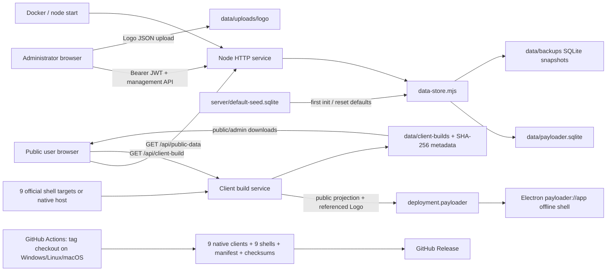

# Payloader v2.0.1 Progress

Last updated: 2026-07-22 (Asia/Shanghai)

This file is the recovery ledger for the v2.0.1 contract-freeze work. Requirement IDs and wording below are fixed. Later updates may only change status markers or append evidence, results, blockers, and notes. Do not silently delete, merge, weaken, or rewrite an acceptance item unless the user explicitly changes the requirement.

Status: `[x]` confirmed by current evidence, `[ ]` not yet accepted, `[!]` blocked or incomplete.

## Fixed acceptance checklist

### Release identity and scope

- [x] R001 Confirm the real annotated `v2.0.0` tag locally and remotely; the tag object must resolve to the same commit in both places.
- [x] R002 Confirm the `v2.0.0` GitHub Release, its Actions build run, the checked-out release tag, and every uploaded asset correspond; distinguish the workflow dispatch SHA from the source commit checked out by build jobs.
- [x] R003 Treat missing historical proof as missing; reconstruct only from repository objects, GitHub API/Actions/Release evidence, files, and reproducible commands, and never invent evidence.
- [x] R004 Use the exact `v2.0.0` source commit as the v2.0.1 implementation baseline; do not use the unrelated current `main` history as product source.
- [x] R005 Do not read or use `docs/updates` prompts from any other software version to expand this roadmap.
- [ ] R006 Deliver only the Payloader `v2.0.1` contract and quality freeze; do not include features from any other software version.
- [ ] R007 Do not change product behavior.
- [ ] R008 Do not migrate the React/Vite, Node.js, SQLite, Electron, or Electron Builder technology stack.
- [ ] R009 Do not add a business workflow.
- [ ] R010 Do not perform opportunistic refactoring.

### Public and management HTTP contracts

- [ ] R011 Freeze `GET /api/public-data` as GET-only with top-level `settings`, `payloads`, `tools`, `navigation`, and `toolNavigation` fields; unsupported methods remain `405`.
- [ ] R012 Freeze public projection selection as `enabled = 1`, ordered by `sort_order, id`; keep the protected XSS system tool/navigation injection and existing payload/tool navigation pruning.
- [ ] R013 Freeze `/api/public-data` representation behavior: weak SHA-256 ETag, `Cache-Control: public, max-age=0, must-revalidate`, `Vary: Accept-Encoding`, Brotli/Gzip negotiation, identity fallback, and `304` on matching ETag.
- [ ] R014 Freeze public routes and methods: `GET /api/health`, `GET /api/ready`, `GET|HEAD /api/r/p`, `GET /api/client-build`, `GET|HEAD /api/client-build/download/latest`, `GET|HEAD /api/client-build/download/:file`, and `GET /api/custom-tools`.
- [ ] R015 Freeze admin authentication routes and methods: `GET /api/admin/session`, `POST /api/admin/login`, and `POST /api/admin/logout`; keep Bearer JWT, no auth cookie, default session TTL `8 hours`, clock skew `30 seconds`, and maximum Bearer length `2048`.
- [ ] R016 Freeze local development credentials as user `admin` and password `payloader-admin!` only for non-production loopback hosts; production or non-loopback first start still requires explicit credentials and a minimum password length of `10`.
- [ ] R017 Freeze request/rate boundaries: default JSON body `4,000,000` bytes; login, credentials, and build-generate body `16,384` bytes; URL `4,096` characters; login username `256` characters; login password `1,024` characters; admin `300/60s`; failed auth `12/60s`; failed login `8/60s`.
- [ ] R018 Freeze authenticated version routes: `GET /api/admin/version-status` and `POST /api/admin/version-check`.
- [ ] R019 Freeze authenticated export/import routes: `GET /api/admin/export`, `GET /api/admin/import-template`, `POST /api/admin/import/preview`, and `POST /api/admin/import`.
- [ ] R020 Freeze authenticated content routes for `payloads`, `tools`, and `navigation`: collection `GET|POST`, item `PUT|DELETE`, and item `POST .../move`; move defaults to `up` unless body direction is exactly `down`.
- [ ] R021 Freeze custom-content routes: `GET|POST /api/admin/custom-content`, `PUT|DELETE /api/admin/custom-content/:id`, and legacy `GET /api/admin/custom-payloads`; destinations remain exactly `payloads|tools`.
- [ ] R022 Freeze settings, Logo, account, reset, and Builder routes: `GET|POST|PUT /api/admin/settings`, `POST /api/admin/logo`, `GET|PUT /api/admin/credentials`, `GET /api/admin/reset-impact`, `POST /api/admin/reset-defaults`, `GET /api/admin/client-builds/status`, `POST /api/admin/client-builds/generate`, and `GET|HEAD /api/admin/client-builds/download/:file`.
- [ ] R023 Freeze Logo input as JSON Base64/Data URL, MIME exactly `image/png|image/jpeg|image/webp`, decoded image at most `1,048,576` bytes, request at most `1,500,000` bytes, and dimensions from `1x1` through `1024x1024`; default `logoUrl` remains empty.

### SQLite, seed, import/export, and recovery contracts

- [ ] R024 Freeze SQLite Schema version `1` with exactly four tables: `metadata`, `payloads`, `tools`, and `navigation_nodes`.
- [ ] R025 Freeze `metadata(key TEXT PRIMARY KEY, value TEXT NOT NULL)`.
- [ ] R026 Freeze `payloads(id TEXT PRIMARY KEY, data TEXT NOT NULL, sort_order INTEGER NOT NULL, enabled INTEGER NOT NULL DEFAULT 1, created_at TEXT NOT NULL, updated_at TEXT NOT NULL)`.
- [ ] R027 Freeze `tools(id TEXT PRIMARY KEY, data TEXT NOT NULL, sort_order INTEGER NOT NULL, enabled INTEGER NOT NULL DEFAULT 1, created_at TEXT NOT NULL, updated_at TEXT NOT NULL)`.
- [ ] R028 Freeze `navigation_nodes(id TEXT PRIMARY KEY, tree TEXT NOT NULL, kind TEXT NOT NULL CHECK(kind IN ('payloads','tools')), sort_order INTEGER NOT NULL, enabled INTEGER NOT NULL DEFAULT 1, created_at TEXT NOT NULL, updated_at TEXT NOT NULL)`.
- [ ] R029 Freeze runtime PRAGMAs: `busy_timeout=5000`, `journal_mode=WAL`, `synchronous=NORMAL`, and `foreign_keys=ON`.
- [ ] R030 Freeze default seed metadata as `seed_schema_version=1` and `content_kind=curated-defaults`; `server/default-seed.sqlite` remains first-initialization and reset input, while `data/payloader.sqlite` remains runtime authority.
- [ ] R031 Freeze all 13 migration markers: `migration_file_upload_basic`, `migration_remove_edr_evasion`, `migration_scrub_retired_edr_text`, `migration_restore_all_payload_public_data_v1`, `migration_business_logic_quality_v1`, `migration_jwt_security_navigation_v1`, `migration_payload_quality_defaults_v1`, `migration_payload_quality_context_v2`, `migration_payload_domain_quality_v3`, `migration_extended_burp_dictionary_payloads_v1`, `migration_payload_content_presentation_v4`, `migration_missing_default_tools_v3`, and `migration_project_attribution_v1`.
- [x] R032 Record database row counts separately from public projection counts, filesystem file counts, ordered ID sequences, byte sizes, and SHA-256 values; never report one of these as another.
- [x] R033 Freeze the tag seed row baseline as `790` payload rows, `378` tool rows, and `23` navigation-root rows (`2` payload roots and `21` tool roots), all enabled; seed SHA-256 is `64472ce883346526e09c8ca9b6c72abb55b255bebd3bef5ec5067373e173d5cd`.
- [x] R034 Freeze the tag public projection baseline separately as `790` payloads, `379` tools, `2` payload navigation roots, and `22` tool navigation roots; the protected system tool/navigation accounts for the stored/public difference.
- [ ] R035 Freeze import format `payloader.import.v1`; accepted data arrays remain `payloads`, `tools`, `navigation`, and `toolNavigation`; `settings` remains ignored.
- [ ] R036 Freeze import modes as exactly `merge|replace`, with default `merge`; replace affects only modules whose fields are present.
- [ ] R037 Freeze import limits: UI file limit `20 MiB`, server request limit `24 MiB`, `10,000` payloads, `10,000` tools, `2,000` payload navigation roots, `2,000` tool navigation roots, `20,000` total navigation nodes per tree input, and depth `12`.
- [ ] R038 Freeze import enums/defaults: command platform `all|windows|linux` with default `all`; tutorial difficulty `beginner|intermediate|advanced|expert`; duplicate IDs are deterministically renamed with the item index and reported as warnings.
- [ ] R039 Freeze protected-import behavior: the built-in XSS platform cannot be overwritten; navigation references to it are pruned from imported content; an unknown non-empty format is compatibility-imported with a warning.
- [ ] R040 Freeze export format `payloader.export.v1`, version `1`, ordered arrays for settings/payloads/tools/navigation/toolNavigation, and current summary fields; export retains all stored content rows but does not emit raw `sort_order` or `enabled` columns.
- [ ] R041 Freeze reset targets as exactly `all|payloads|tools|navigation|settings`; `navigation` resets both `navigation` and `toolNavigation`.
- [ ] R042 Freeze reset safety: compute impact before mutation, create the backup before deletion, fail without changing content when backup fails, serialize queued writes, and invalidate public projection cache after success.
- [ ] R043 Freeze backup placement and naming under `data/backups/payloader-before-reset-<target>-<timestamp>-<id>.sqlite`; allowed methods remain `node:sqlite.backup|checkpoint-vacuum-into`; every accepted backup must pass `PRAGMA integrity_check = ok`.
- [ ] R044 Freeze the actual recovery boundary: v2.0.0 has no dedicated restore-from-backup HTTP/UI workflow; recovery evidence must prove the SQLite backup is restorable without adding a new product workflow.

### Migration fixture, Builder, client, and Release assets

- [ ] R045 Add one repeatable v2.0.0 migration fixture generated in a temporary directory; it must never mutate `data/payloader.sqlite` or `server/default-seed.sqlite`.
- [ ] R046 The migration fixture must preserve custom content in both `payloads` and `tools` destinations.
- [ ] R047 The migration fixture must preserve a referenced custom Logo file and its `settings.logoUrl`.
- [ ] R048 The migration fixture must preserve explicit `sort_order` values and verify both raw row order and projected order.
- [ ] R049 The migration fixture must preserve both enabled and disabled rows and verify disabled rows stay absent from public projection.
- [ ] R050 The migration fixture must preserve client information, including `latest.json`, artifact metadata, target ID, public counts, source/public-data hashes, file size, file SHA-256, build contract, and freshness state.
- [ ] R051 Run the same migration fixture at least twice from clean temporary roots and obtain identical normalized counts, ordered IDs, file inventory, and SHA-256 evidence after removing explicitly volatile timestamps/paths.
- [ ] R052 Freeze Electron client metadata version `3`, build contract version `7`, deployment format `payloader.deployment.v1`, deployment package version `1`, and per-file maximum `128 MiB`.
- [ ] R053 Freeze deployment package required files as `public-data.json` and `custom-tools.json`; only referenced Logo assets are allowed; public stats remain separate `payloads|tools|navigation|toolNavigation` counts.
- [ ] R054 Freeze the 14 Builder targets in source order: `win-x64-nsis`, `win-arm64-nsis`, `win-ia32-nsis`, `linux-x64-appimage`, `linux-arm64-appimage`, `linux-armv7l-appimage`, `linux-x64-deb`, `linux-arm64-deb`, `linux-armv7l-deb`, `linux-x64-rpm`, `linux-arm64-rpm`, `mac-x64-dmg`, `mac-arm64-dmg`, and `mac-universal-dmg`.
- [ ] R055 Freeze the 9 official shell/direct-client targets: three Windows NSIS architectures, three Linux AppImage architectures, and three macOS DMG architectures.
- [ ] R056 Freeze the client as offline under `payloader://app`, with renderer network schemes blocked, only fixed external project/XSS links opened by the OS browser, single-instance behavior, `contextIsolation=true`, `nodeIntegration=false`, and `sandbox=true`.
- [ ] R057 Freeze client exclusions: no admin UI/API, credentials/JWT/signing secrets, server environment, SQLite databases, backups, or private uploads in the deployment package.
- [ ] R058 Freeze Windows installer defaults: assisted NSIS, `oneClick=false`, per-user (`perMachine=false`), no elevation, custom installation directory allowed, desktop/start-menu shortcuts enabled, and `runAfterFinish=false`.
- [x] R059 Freeze Release upload inventory as exactly `20` uploaded assets: `9` direct native clients, `9` official shell transports, `payloader-client-shells.json`, and `SHA256SUMS.txt`; record GitHub's two automatic source archives separately rather than calling them uploaded assets.
- [x] R060 Freeze `SHA256SUMS.txt` as exactly `19` unique entries covering every uploaded asset except the checksum file itself; every checksum must equal the GitHub API asset digest.
- [x] R061 Freeze `payloader-client-shells.json` as format `payloader.client-shells.v1`, manifest version `1`, app version matching the release, build contract `7`, deployment package version `1`, and exactly `9` target entries with size and SHA-256.

### Automated regressions and responsive baselines

- [ ] R062 Add automated regression for the public site's load, error, empty, populated, search, selection, standard/WAF mode, global-variable, copy, codec, client-download current/stale/empty, theme, keyboard, and mobile-navigation states.
- [ ] R063 Add automated regression for the admin login/session boundary and all 8 modules: site settings, Payload, tools, navigation, client generation, system update, account security, and custom content.
- [ ] R064 Add automated admin workflow coverage for list/filter/search, list/editor selection, create/edit/save/cancel, move, delete, Logo upload, import preview/merge/replace, export, reset impact/backup, Builder states, update states, validation errors, empty states, loading states, and failure states.
- [ ] R065 Add automated client-shell regression for external deployment loading, public snapshot/custom content/Logo integrity, offline network blocking, renderer readiness/search interaction, single instance, artifact metadata, and clean shutdown.
- [ ] R066 Add automated local Release-directory regression for exact asset whitelist, file count, file order, byte size, SHA-256, checksum coverage, shell manifest, version, tag, and build contract before any upload.
- [ ] R067 Establish a pinned Chromium desktop baseline at `1440x900` and mobile baseline at `390x844`; also assert behavior immediately around public `900px` and admin `860px` responsive breakpoints.
- [ ] R068 Preserve the public UI hierarchy: dense dark workbench, top tools/modes, searchable left navigation, and primary content workspace; do not redesign it as a landing page or generic card dashboard.
- [ ] R069 Preserve the admin UI hierarchy: restrained light workspace, dark global navigation, `224px` desktop sidebar, list/editor work area, one primary action, and clearly separated destructive/data-maintenance actions.
- [ ] R070 Preserve the mobile admin workflow: module selector, `list|editor` segmented switch, bounded scrollable record list, visible status, and bottom contextual actions; controls remain at least `44px`, keyboard focus remains visible, and reduced motion is honored.
- [ ] R071 Run browser baselines against deterministic fixture data; animations, time, network update checks, and volatile client timestamps must be controlled rather than accepted by updating screenshots blindly.
- [ ] R072 Final acceptance requires the same baseline to be repeatably verifiable and no regression in public site, admin, client, backup/recovery, deployment, or Release assets; every conclusion must name the command, exit result, key count, and evidence path.

## System function map

Primary users and flows:

- Public security practitioner: search or browse Payload/tools, choose standard or WAF content, set variables, inspect/copy commands, use codecs, and download a verified client.
- Administrator: authenticate, locate a high-density record, edit/save/reorder content or settings, preview import/reset impact, preserve a backup, and inspect/generate client artifacts.
- Offline client user: open the packaged public snapshot, search and use the same public workbench without server/admin/private data or renderer network access.
- Deployer/releaser: build and run the Node service with persistent `data/`, verify readiness, build native shells from the immutable release tag, validate hashes/manifests, then publish a draft and finally a Release.
- Recovery operator: use the pre-reset SQLite backup as a verified restorable database artifact; v2.0.0 does not expose a separate restore UI/API.

## Current repository findings

- No repository `AGENTS.md` or `CODEX.md` exists in the current or release worktree. The user-supplied Windows PowerShell discipline governs this work.
- Current worktree: `C:\Users\Hezihao\Desktop\payloader`, `main@e0498d676b6e16f5b6363a035d05e903ef4743ba`, unrelated to the v2 release history, `ahead 37, behind 12`, with existing untracked `DESIGN.md`, `PRODUCT.md`, `audit-workspace/`, `data/`, `docs/`, `output/`, and `scripts/`.
- Release worktree: `C:\Users\Hezihao\Desktop\payloader-public-release`, clean `codex/public-v2-release@b81dd7ff9a65c9d2e6b23d3f597776f720402e7f`; this is the exact annotated `v2.0.0` source tree.
- Local tag object is `d88a035d033184e831e3878310e5763cfd4bbe78`; local and remote peeled commit is `b81dd7ff9a65c9d2e6b23d3f597776f720402e7f`.
- GitHub Release ID `354670928` is published, not draft, not prerelease, and reports 20 uploaded assets. Release page: `https://github.com/3516634930/Payloader/releases/tag/v2.0.0`.
- Actions run `29444901350` was manually dispatched from historical workflow SHA `dba4ea5f4b33a4d4020dde5f02f94413d9c24fbb`; all build jobs explicitly checked out the release tag. Six jobs succeeded: tag validation, Windows/Linux/macOS builds and shell smokes, merge/manifest validation, and Release publication.
- Remote `SHA256SUMS.txt` has 19 unique entries; GitHub API digest mismatches: 0; uncovered uploaded assets: 0. Remote shell manifest has 9 target keys, app version `2.0.0`, build contract `7`, deployment package version `1`.
- The later successful Quality run `29487454357` used `origin/main@e9facd0`; the only source-tree differences from `v2.0.0` are `README.md` and `screenshots/readme/09-client-workspace.png`, so product code matches the tag.
- Default seed: 790 payload rows, 378 tool rows, 23 navigation rows (2 payload, 21 tool), all enabled; SHA-256 `64472ce883346526e09c8ca9b6c72abb55b255bebd3bef5ec5067373e173d5cd`.
- Current worktree runtime DB has the same content-row counts but a different file size, metadata history, WAL state, and SHA-256 `7e6ee838d5cee62308104f2accee01b10d6135a2d48722046d0fefbbfc60e9a4`; it is user/runtime state, not the release seed artifact.
- UI evidence inspected at 1440x900: `screenshots/readme/01-workspace-search.png`, `04-admin-content.png`, and `06-client-builder.png`. Mobile evidence inspected at 390x844: `audit-workspace/admin-final-mobile.png`.
- Existing tests are Node unit/contract/API tests plus real Electron/CDP performance smoke. There is no committed Playwright configuration or automated screenshot comparison; `.playwright-cli` contains manual artifacts only.
- Existing design references are `DESIGN.md` and `PRODUCT.md`: public workbench remains dark and dense; admin remains a restrained light workspace with dark navigation; mobile uses module and list/editor switches.

## Implementation batches

### Batch 0 - Establish the immutable working baseline

Status: `[x]` completed 2026-07-22 in `C:\Users\Hezihao\Desktop\payloader-v2.0.1`.

Dependencies: none.

Changes:

- Create a new `codex/v2.0.1-contract-freeze` branch/worktree from annotated tag `v2.0.0`; do not switch or clean the unrelated current `main` worktree.
- Bring this progress file into that branch without importing unrelated untracked files.
- Replace the broken `node_modules` junction only inside the new worktree and run `npm ci` with Node `22.x`/npm `10+` as required by `package.json`.
- Capture tool versions, commit/tag IDs, tracked-file inventory, seed size/SHA-256, DB counts, public counts, ordered IDs, and remote Release metadata into small evidence manifests under `docs/release-evidence/v2.0.1/`.

Tests first / verification:

- `git status --short --branch`
- `git rev-parse HEAD` and `git describe --exact-match --tags HEAD`
- `npm ci`
- `npm run check`
- Run the read-only baseline capture twice and diff normalized output.

Independent acceptance: exact tag source, clean product tree, working dependencies, complete gate green, and two matching normalized baseline captures.

Backup/rollback: no current-worktree checkout, reset, clean, or data deletion. If setup fails, remove only the newly created worktree after resolving and printing its absolute path; retain this ledger and command results.

### Batch 1 - Characterize SQLite, seed, migration, ordering, and client state

Status: `[ ]`.

Dependencies: Batch 0.

Tests first:

- Extend `tests/data-safety.test.mjs` with a v2.0.0 fixture round-trip covering custom payload/tool content, custom Logo reference/file, non-contiguous sorting, enabled/disabled rows, all migration markers, and raw/public count separation.
- Extend `tests/client-build-metadata.test.mjs` with deterministic `latest.json`, artifact, sidecar checksum, public stats, source/public-data hashes, build contract, and freshness cases.
- Add a small fixture builder/support module under `tests/fixtures/v2.0.0/`; generate SQLite and mutable files in `mkdtemp`, not as a second runtime implementation and not by copying live `data/`.

Expected changed files:

- `tests/data-safety.test.mjs`
- `tests/client-build-metadata.test.mjs`
- `tests/fixtures/v2.0.0/README.md`
- `tests/fixtures/v2.0.0/build-runtime-fixture.mjs`
- `docs/release-evidence/v2.0.1/baseline-data.json`

Verification:

- `node --test tests/data-safety.test.mjs tests/client-build-metadata.test.mjs`
- Run the fixture twice from clean temporary roots; compare normalized database rows, public projection, file inventory, order, sizes, and SHA-256.
- `npm run check`

Independent acceptance: R024-R034 and R045-R051 have reproducible evidence without modifying seed/runtime data.

Backup/rollback: tests own and delete only their `mkdtemp` roots. Any discovered need to change `server/data-store.mjs` or `server/client-builder.mjs` must first be demonstrated by a failing characterization test; no cleanup/refactor is allowed.

### Batch 2 - Freeze public/admin API, import/export, backup, and recovery

Status: `[ ]`.

Dependencies: Batch 1 fixture.

Tests first:

- Extend `tests/api-smoke.test.mjs` to snapshot all public/admin route methods, status codes, key response fields, auth boundary, request limits, and download headers.
- Extend `tests/public-data-response.test.mjs` for identity/Gzip/Brotli, ETag/304, cache headers, projection ordering, and disabled-row exclusion.
- Extend `tests/data-safety.test.mjs` for import `merge|replace`, all numeric limits, export quirks, reset target matrix, failed-backup no-op, and a full restore exercise using the created SQLite backup.
- Reuse current store/server entry points; do not create alternate API or storage code.

Expected changed files:

- `tests/api-smoke.test.mjs`
- `tests/public-data-response.test.mjs`
- `tests/data-safety.test.mjs`
- `tests/fixtures/v2.0.0/import-contract.json`
- `docs/release-evidence/v2.0.1/api-data-contract.json`

Verification:

- `node --test tests/api-smoke.test.mjs tests/public-data-response.test.mjs tests/data-safety.test.mjs`
- `npm run check`
- Docker read-only smoke using the existing `.github/workflows/quality.yml` command shape.

Independent acceptance: R011-R044 pass from a clean fixture, including backup integrity and recovery, with no new route or workflow.

Backup/rollback: all API tests use an ephemeral port and temporary data directory. Never point test environment variables at the user's `data/`; preserve a failing fixture directory only when its path is recorded as evidence.

### Batch 3 - Add deterministic desktop/mobile browser baselines

Status: `[ ]`.

Dependencies: Batch 2 stable fixture server.

Design/workflow baseline before code:

- Public workflow: search/browse -> select Payload/tool -> standard/WAF -> variables/copy -> codec -> client downloads.
- Admin workflow: login -> module -> list/filter/search -> select/edit/save or high-risk preview -> backup/result.
- Desktop hierarchy stays header/sidebar/content for public and 224px nav/list/editor for admin.
- Mobile hierarchy stays module selector plus list/editor segment and contextual bottom actions; no feature removal.
- Required states are loading, populated, empty, validation error, server error, current/stale/failed client build, modal open/closed, keyboard focus, and reduced motion.

Tests first / expected changed files:

- Add `@playwright/test` as a development-only dependency in `package.json` and `package-lock.json`.
- Add `playwright.config.ts` with pinned Chromium projects at 1440x900 and 390x844 plus breakpoint probes at 901/899 and 861/859 pixels.
- Add `tests/browser/public.spec.ts`, `tests/browser/admin.spec.ts`, and a fixture-server helper that uses the real Node service with temporary data.
- Add reviewed snapshots under `tests/browser/__screenshots__/`; never accept a changed snapshot without a matching behavioral explanation.
- Update `.github/workflows/quality.yml` to install pinned Chromium and run functional/visual tests on one stable Linux image; update `.gitignore` only for generated Playwright reports, not accepted baselines.

Verification:

- `npx playwright test`
- `npx playwright test --project=desktop-chromium`
- `npx playwright test --project=mobile-chromium`
- Keyboard-only pass, console/network error assertion, screenshot dimension check, and `npm run check`.

Independent acceptance: R062-R064 and R067-R071 pass at both reference viewports and breakpoint boundaries with no product CSS/JS change unless a confirmed v2.0.0 regression requires a narrowly approved fix.

Backup/rollback: retain the original v2.0.0 screenshots as immutable references; screenshot updates require review. Test reports and traces are generated artifacts and must not replace accepted baselines.

### Batch 4 - Freeze Electron shell and local Release-asset contracts

Status: `[ ]`.

Dependencies: Batches 1 and 3.

Tests first:

- Extend `tests/client-deployment-package.test.mjs`, `tests/client-build-metadata.test.mjs`, `tests/client-shell-release-assets.test.mjs`, `tests/client-release-context.test.mjs`, and `tests/production-config.test.mjs` with v2.0.0 fixture and exact inventory assertions.
- Extend `scripts/smoke-client-performance.mjs` through its existing CDP lane to capture/assert the offline workspace, custom content/Logo, network blocking, search readiness, and shutdown; do not add renderer privileges.
- Add `scripts/verify-release-assets.mjs` as a verifier for a local asset directory. It validates version/tag/contract, exact 20-file whitelist, lexical order, per-file byte size/SHA-256, 19 checksum entries, and 9 shell-manifest targets; it does not publish.

Expected changed files:

- `tests/client-deployment-package.test.mjs`
- `tests/client-build-metadata.test.mjs`
- `tests/client-shell-release-assets.test.mjs`
- `tests/client-release-context.test.mjs`
- `tests/production-config.test.mjs`
- `scripts/smoke-client-performance.mjs`
- `scripts/verify-release-assets.mjs`
- `package.json`
- `docs/release-evidence/v2.0.1/client-release-contract.json`

Verification:

- Focused Node tests above.
- `npm run verify:client-performance` on Windows/macOS and `xvfb-run --auto-servernum npm run verify:client-performance` on Linux CI.
- `npm run verify:client-shell` against each native runner output.
- `node scripts/verify-release-assets.mjs <local-asset-directory>`.
- `npm run check`.

Independent acceptance: R052-R061 and R065-R066 pass without changing Builder target behavior, client privilege/network policy, or asset set.

Backup/rollback: Builder outputs go to a dedicated temporary/artifact directory. Keep the last successful metadata and never point cleanup at user client builds. A failed verifier blocks upload; it does not rewrite hashes or manifests.

### Batch 5 - Version-only release candidate and final evidence

Status: `[ ]`.

Dependencies: Batches 0-4 green.

Changes:

- Change only release-facing version metadata from `2.0.0` to `2.0.1` in `package.json` and `package-lock.json`; update only version-specific README download/changelog references needed to avoid false links or stale claims.
- Build the same 9 native clients and 9 official shells from the immutable v2.0.1 tag candidate using existing workflows; no target, signing, installer, data, or UI behavior change.
- Produce final manifests under `docs/release-evidence/v2.0.1/` with separate database counts, public counts, file counts, ordered names/IDs, sizes, and SHA-256.
- Publishing remains a manual external gate: this checkout has push URLs disabled. Use an authorized publishing checkout, create a draft Release, upload/verify the exact set, then publish only after explicit approval.

Expected changed files:

- `package.json`
- `package-lock.json`
- `README.md` only where version-specific facts require it
- `.github/workflows/client-shells.yml` only if evidence upload wiring is required; no build behavior changes
- `docs/release-evidence/v2.0.1/PROGRESS.md`
- `docs/release-evidence/v2.0.1/*.json`

Verification:

- Full `npm run check`, Playwright desktop/mobile, Docker read-only smoke, three-OS client performance/shell smoke, and local asset verifier.
- Compare v2.0.0 and v2.0.1 normalized API/data/UI/Builder contracts; only version/timestamp/hash fields explicitly expected to change may differ.
- After draft upload, query GitHub tag, run, Release, asset API, shell manifest, and checksum file; require 20 uploaded assets, 19 checksum entries, 9 shell targets, and 0 digest mismatches.

Independent acceptance: all R001-R072 are checked with evidence paths and no behavior delta.

Backup/rollback: do not move or retag `v2.0.0`. Before publishing, rollback is ordinary branch commit reversal. After draft creation, keep it draft or remove only the v2.0.1 draft assets through the authorized publishing lane. Never overwrite a published tag or reuse a failed artifact hash.

## Completed this round

- Read repository README, package/build/deploy configuration, product/design references, tag tree, key public/admin/data/Builder/Electron paths, tests, workflows, SQLite files, screenshots, Git history, and remote Release/Actions metadata.
- Confirmed no repository `AGENTS.md`/`CODEX.md`; did not read `docs/updates`.
- Confirmed v2.0.0 local/remote tag and Release/build/asset chain.
- Separated seed DB counts, public projection counts, runtime DB identity, Release upload count, source archive count, shell target count, and checksum count.
- Observed existing public/admin desktop pages and the admin mobile layout before planning frontend work.
- Changed no product code or existing data. The only new project file is this progress ledger.

## Verification results this round

- `git status --short --branch` (current worktree): exit 0; `main...origin/main [ahead 37, behind 12]`; existing untracked files preserved.
- `git status --short --branch` (release worktree): exit 0; clean `codex/public-v2-release...origin/main [behind 2]`.
- `git cat-file -t v2.0.0` and `git rev-list -n 1 v2.0.0`: exit 0; annotated tag -> `b81dd7ff9a65c9d2e6b23d3f597776f720402e7f`.
- `git ls-remote --tags origin refs/tags/v2.0.0 refs/tags/v2.0.0^{}`: exit 0; remote annotated tag object and peeled commit match local.
- GitHub Release/API read: exit 0; Release ID 354670928, 20 uploaded assets, 19 checksum entries, 0 digest mismatches, 0 uncovered uploaded assets.
- GitHub Actions API read: exit 0; release run 29444901350 has 6 successful jobs and 4 retained workflow artifacts; Quality run 29487454357 has successful gate, container smoke, and three-OS performance jobs.
- Read-only `node:sqlite` inventory: exit 0; seed 790/378/23 stored rows; runtime counts recorded separately; no database write was issued.
- `npm run check` in release worktree: exit 1. `verify:attribution` passed for 8 files; `typecheck` did not start because `tsc` was unavailable.
- Dependency check: exit 0; `node_modules` is a junction to missing `C:\Users\Hezihao\Desktop\payloader\node_modules`; `.bin/tsc.cmd` and `typescript/bin/tsc` are absent. Node `v24.12.0`, npm `11.6.2` are installed, but the tag requires a clean Node 22 dependency install for baseline parity.
- Post-command Git status: no tracked changes in either worktree.
- `npm ci` with Node `v22.23.1` and npm `10.9.8`: exit 0; 490 locked packages installed; `package-lock.json` SHA-256 remained `ee49edae2b4150d53651a4bab0c6a6d0691791e88c6482bc710f202adba8d42c`.
- Clean-worktree focused regression before the test fix: exit 1; exactly 3 published-snapshot tests failed because they read absent mutable `data/payloader.sqlite`; Node `v22.23.1` removed the separate old-Node URL compatibility failure.
- Focused regression after switching those three existing assertions to tracked `server/default-seed.sqlite`: exit 0; 40/40 tests passed and no `data/` directory was created.
- Baseline-tool red/green tests: module missing -> 2 failures; retry missing -> 1 failure; cache validation missing -> 1 failure; runtime timestamp normalization missing -> 1 failure; mutable worktree anchoring -> 1 failure; final `node --test tests/release-baseline-evidence.test.mjs`: exit 0, 6/6 passed.
- Final `npm run check` with no pre-existing runtime database: exit 0; attribution 8 files, typecheck/lint pass, codec 114 checks, curation 790/790, content quality pass, Node tests 183/183, production build pass in 165 ms.
- Two final normalized captures: exit 0; each 290,333 bytes; each SHA-256 `868736d80329e9584b97a70d8ed677b59f331eefe383a5abf782b592766a3d84`; `git diff --no-index --exit-code` exit 0.
- Canonical self-repeat using `--release-input docs/release-evidence/v2.0.1/baseline-v2.0.0.json`: exit 0; output SHA-256 unchanged and diff exit 0.

## Batch 0 completion

- Branch/worktree: `codex/v2.0.1-contract-freeze` at `C:\Users\Hezihao\Desktop\payloader-v2.0.1`, created directly from `v2.0.0` commit `b81dd7ff9a65c9d2e6b23d3f597776f720402e7f`.
- Added `scripts/capture-release-baseline.mjs` and npm command `evidence:baseline`. It hashes the tagged Git blob inventory, reads the tracked seed, initializes the real data store only under `mkdtemp`, calculates the public projection, and verifies local/remote tag plus Release/checksum/shell evidence.
- Added `tests/release-baseline-evidence.test.mjs`; changed only the data source of three published-catalog tests from ignored runtime state to the tracked published seed. Assertions and expected counts were not weakened.
- Evidence: `docs/release-evidence/v2.0.1/baseline-v2.0.0.json` and `baseline-reproducibility.json`.
- Source-tree scope: 236 tagged files, 31,200,999 bytes, inventory SHA-256 `0b618e2c6787f24c8919c6b9152903c6a357a8634581ee7d799a80ba9d51a691`.
- Database scope: seed metadata/payload/tool/navigation records `4/790/378/23`; initialized runtime metadata/payload/tool/navigation records `30/790/378/23`; public projection `790/379/2/22`. These are not file counts.
- File/Release scope: seed file 11,427,840 bytes with SHA-256 `64472ce883346526e09c8ca9b6c72abb55b255bebd3bef5ec5067373e173d5cd`; Release uploads 20, automatic source archives 2, checksum entries 19, shell targets 9, digest mismatches 0, uncovered uploads 0.
- Review: no changes under `src/`, `admin/`, or `server/`; no Schema, seed, lockfile, public API, Builder, Electron, UI, or product behavior change. `git diff --check` exit 0.

## Blockers and next step

- The current worktree is not a safe implementation base because its checked-out `main` history is unrelated and lacks the v2.0.0 backend, tests, and Electron files.
- The release worktree cannot currently rerun the gate because its dependency junction target is absent.
- This checkout intentionally cannot push; final tag/Release work needs a separate authorized publishing lane and explicit approval.
- Batch 0 resolved the missing-dependency and unsafe-base blockers through the isolated tagged worktree; neither original worktree was switched or cleaned.
- Live GitHub refresh is currently limited by exhausted anonymous API quota and Node connection timeouts to the download domain on this host. The successful online evidence is preserved in the canonical manifest; cached input is tag/structure validated, and live refresh remains available when quota/network access returns. This does not block Batch 1.

Next step: start Batch 1 by adding the repeatable v2.0.0 migration fixture under temporary roots, beginning with failing coverage for custom payload/tool content, Logo references/files, non-contiguous sorting, enabled/disabled rows, migration markers, and client metadata.
